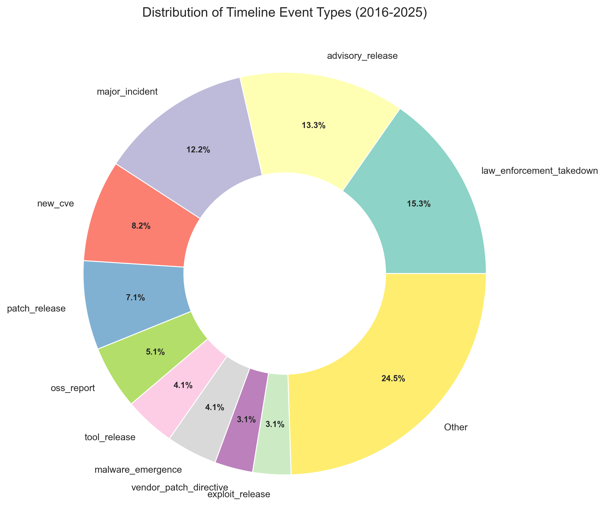
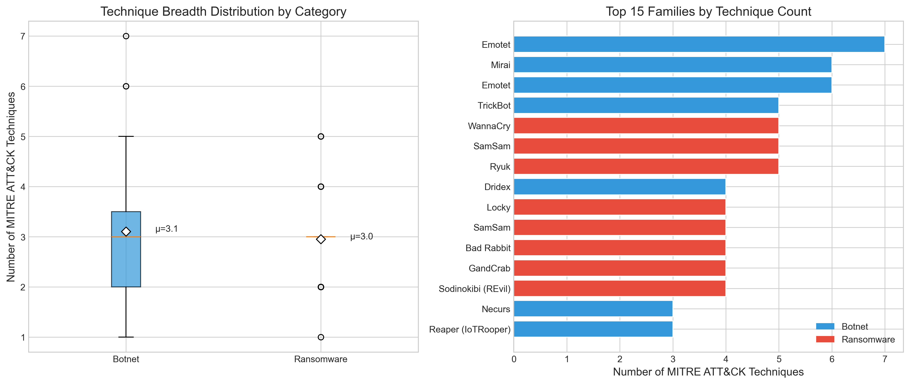
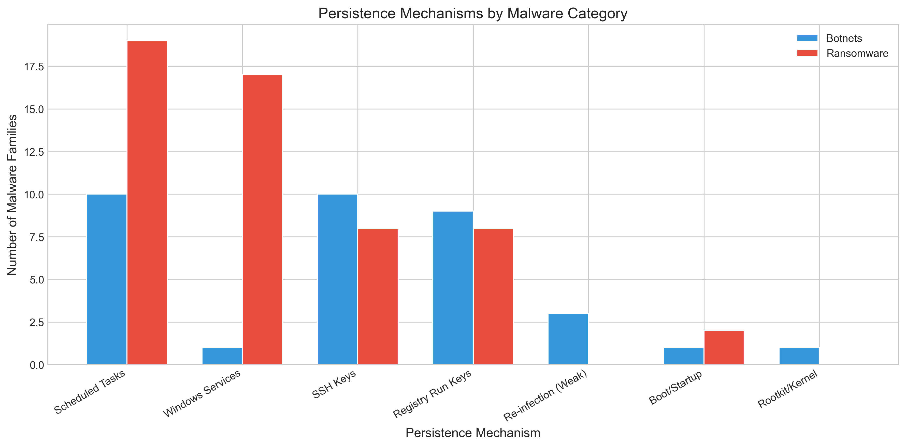
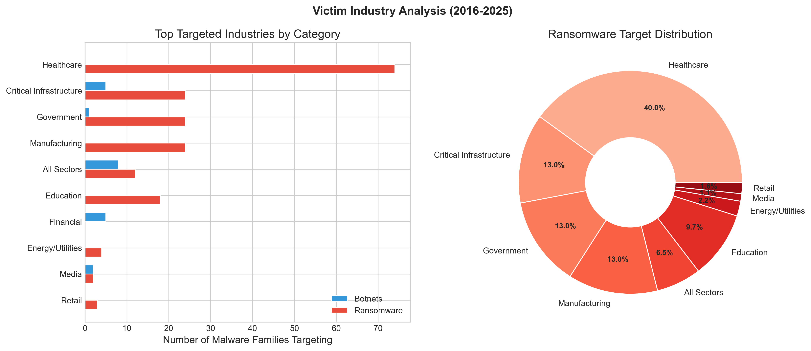
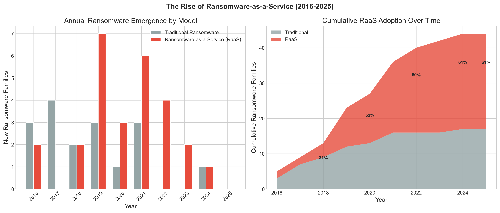

# Research Metrics & Analysis Results

This document presents the key findings, metrics, and statistical analysis from the FSCT 7910 research project on malware evasion techniques.

## Executive Summary

- **Total Timeline Events Analyzed:** 98
- **Timeline Date Range:** February 18, 2016 – October 20, 2025
- **Botnet Families:** 19
- **Ransomware Families:** 64
- **Total Malware Families:** 83
- **Longest Active Malware:** Qakbot (16.7 years)
- **Double Extortion Prevalence:** 54.7% of ransomware families

## Key Findings

### Family Distribution

| Category | Count | Mean Technique Count | Technique Range | Mean Duration (years) | Max Duration (years) | Ongoing Families |
|----------|-------|----------------------|--------------------|----------------------|----------------------|------------------|
| Botnets | 19 | 3.1 | 1–7 | 7.6 | 16.7 | 9 |
| Ransomware | 64 | 3.0 | 1–5 | 3.9 | 9.9 | 33 |

### Double Extortion Adoption

Among the 64 ransomware families analyzed:
- **35 families** (54.7%) employ double extortion tactics
- **29 families** (45.3%) rely solely on encryption

This indicates that over half of modern ransomware operations have adopted the double extortion model, combining data exfiltration with file encryption.

## Event Cadence (2016–2025)

Timeline events are tracked across 32 distinct event types, including advisories, arrests, botnet activity, exploits, malware emergence, patches, and more.

### Events by Year

| Year | Total Events |
|------|-------------|
| 2016 | 10 |
| 2017 | 10 |
| 2018 | 2 |
| 2019 | 12 |
| 2020 | 13 |
| 2021 | 12 |
| 2022 | 10 |
| 2023 | 10 |
| 2024 | 9 |
| 2025 | 10 |

**Observation:** The analysis captures a relatively steady stream of significant events over the decade, with particular activity spikes in 2019–2021, corresponding to the rise of ransomware-as-a-service operations.

### Event Type Distribution

## Malware Active Duration

The longest-running malware families indicate persistent threats that have remained relevant for over a decade:

### Top 10 Longest-Running Malware

| Rank | Malware Family | Category | Duration (years) | Status |
|------|----------------|----------|-----------------|--------|
| 1 | Qakbot | Botnet | 16.7 | Ended |
| 2 | Necurs | Botnet | 13.9 | Ongoing |
| 3 | Emotet | Botnet | 11.9 | Ongoing |
| 4 | Dridex | Botnet | 11.9 | Ongoing |
| 5 | Dharma (Crisis) | Ransomware | 9.9 | Ongoing |
| 6 | SamSam | Ransomware | 9.9 | Ongoing |
| 7 | Locky | Ransomware | 9.8 | Ongoing |

**Key Insight:** Botnets demonstrate greater longevity than ransomware, with an average active duration of 7.6 years compared to 3.9 years for ransomware. This reflects the sustained profitability of botnet operations in various markets (spam, DDoS, credential theft).

## MITRE ATT&CK Technique Breadth

Analysis of MITRE ATT&CK framework coverage reveals the tactical sophistication of malware families.

### Top Families by Technique Count

| Rank | Malware Family | Category | Technique Count |
|------|----------------|----------|-----------------|
| 1 | Emotet | Botnet | 7 |
| 2 | Mirai | Botnet | 6 |
| 3 | Emotet | Botnet | 6 |
| 4 | TrickBot | Botnet | 5 |
| 5 | SamSam | Ransomware | 5 |
| 6 | Ryuk | Ransomware | 5 |
| 7 | WannaCry | Ransomware | 5 |

### Distribution Summary

- **Botnet Technique Range:** 1–7 techniques
- **Ransomware Technique Range:** 1–5 techniques
- **Average Botnet Techniques:** 3.1 per family
- **Average Ransomware Techniques:** 3.0 per family

**Observation:** While botnets exhibit slightly greater tactical diversity (higher maximum and range), both categories average around 3 distinct MITRE ATT&CK techniques, indicating comparable operational complexity.

## Timeline Trends

### Event Type Distribution

Major event types tracked include:
- **Advisory Releases** — Security advisories and guidance
- **Botnet Activity** — Confirmed botnet command & control or infection campaigns
- **Exploits** — In-the-wild exploitation or disclosure
- **Malware Emergence/Evolution** — New variants or capability changes
- **Law Enforcement Actions** — Arrests, takedowns, disruptions
- **Patch Releases** — Software updates addressing vulnerabilities
- **Research & Disclosures** — Academic or security research publications

### Notable Periods

- **2019–2021:** Peak activity across multiple threat vectors (WannaCry aftermath, ransomware-as-a-service expansion, Emotet dominance)
- **2022–2024:** Increased law enforcement action and advisory releases (5 advisories in 2024 alone)
- **2025 (YTD):** Continued advisory activity with 5 releases; KEV (CISA Known Exploited Vulnerabilities) catalog update recorded

## Data Quality & Coverage

- **Data Sources:** Raw CSVs spanning 2016–2025
- **Deduplication:** By incident_id to eliminate duplicate records
- **Categories:** Ransomware and Botnet families
- **Techniques:** MITRE ATT&CK framework mapping
- **Timeline Events:** Manually curated from security research and public sources

## Limitations & Notes

- CVE-to-exploitation lag analysis requires additional data linkage not present in current datasets
- Some malware families may have entries across multiple years if incidents or variants were reported separately
- Timeline events reflect publicly available information and documented incidents
- Double extortion classification is based on documented group behavior

## Analysis Files

All raw analysis data is available in the `analysis/` directory:

- `summary_statistics.csv` — Key metrics summary
- `event_cadence.csv` — Events by type and year
- `malware_duration.csv` — Family active durations
- `technique_breadth.csv` — Technique counts by family

For scripts used to generate these metrics, see `scripts/generate_paper_metrics.py`.
